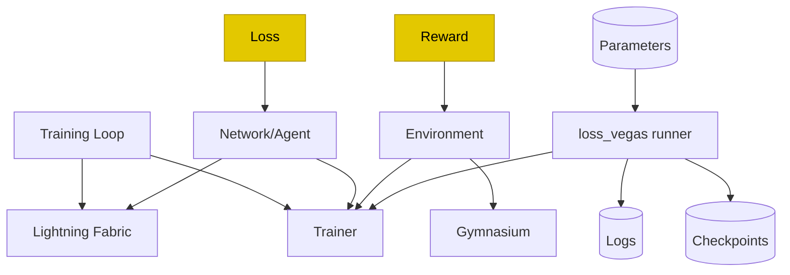

# loss_vegas — Training Pipeline

```mermaid
flowchart TD
    LF[Lightning Fabric]
    TL[Training Loop]
    NA[Network/Agent]
    T[Trainer]
    ENV[Environment]
    GYM[Gymnasium]
    LVR["loss_vegas runner"]
    LOSS[Loss]:::highlight
    REWARD[Reward]:::highlight
    P[(Parameters)]
    LOGS[(Logs)]
    CHKPT[(Checkpoints)]

    TL --> LF
    NA --> LF
    LOSS --> NA
    TL --> T
    NA --> T
    ENV --> T
    REWARD --> ENV
    ENV --> GYM
    LVR --> T
    P --> LVR
    LVR --> LOGS
    LVR --> CHKPT

    classDef highlight fill:#e3c800,stroke:#B09500,color:#000000
```
